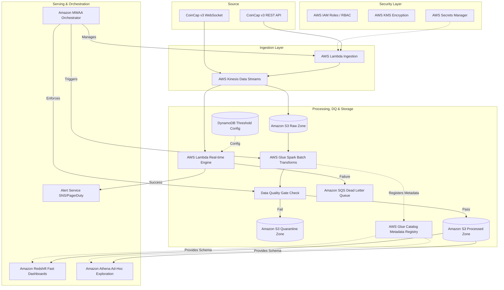

# Crypto Market Data Pipeline -Phase 3: Architecture


## 1. Tech Stack & Cost Justification

**Context & Scale:** As per our requirement, the system must handle 5,000 coins updating at a 1-minute frequency. This translates to ~5,000 records/minute (~83 records/second).

**Ingestion Layer:**
- **AWS Kinesis Data Streams:** Chosen over Kafka for cost-efficient scaling. **Scale/Cost Math:** At 5,000 msgs/min (83 msgs/sec), Kinesis costs roughly ~$45/month to operate. A managed Kafka cluster (Amazon MSK) requires an always-on baseline compute cluster costing upwards of ~$300/month. For this MVP scale, Kinesis is the mathematically correct choice.
- **CoinCap v3 API:** The real-time data source.
- **AWS Lambda (Ingestion):** Polling fallback triggered by EventBridge. **Execution Transition:** The `ingest.py` logic built in Phase 1 directly ports here. The `CoinCapClient` utilizing the `RetryHandler` (Exponential Backoff for 429 rate limits) and `SchemaValidator` will run as the Lambda function body, publishing valid Parquet/JSON records natively to Kinesis instead of the local disk.

**Storage Layer:**
- **Amazon S3:** Central Data Lake partitioned by execution date (`YYYY-MM-DD`) into zones (`S3Raw`, `S3Proc`, `S3Quarantine`).
- **AWS Glue Catalog:** Acts strictly as the metadata registry. It is *not* a storage destination; it registers table schemas natively enabling downstream query engines to read S3 objects.
- **Amazon Athena:** Used for ad-hoc, low-cost data science exploration and debugging queries directly on the S3 Data Lake without provisioning infrastructure.
- **Amazon Redshift Serverless:** The Serving Layer. Unlike Athena, Redshift provides sub-second query caching required for outward-facing production dashboards and aggregated BI alerts.

**Processing & Data Quality Layer:**
- **AWS Glue (Spark):** Handles heavy batch transformations. **Execution Transition:** The Pandas logic from `transform.py` Phase 2 (calculating the 7-day SMA, identifying High Volatility days > 5%, and ranking Top 5 Winners) will be rewritten in PySpark. This ensures the SMA calculation can horizontally scale across all 5,000 assets simultaneously.
- **Data Quality (DQ) Checkpoint:** Deployed immediately after GlueBatch computation. **Execution Transition:** The `DataQualityChecker` from Phase 2 (asserting `volumeUsd24Hr` is non-negative and preventing date gaps) becomes a strict validation gate here. Valid data lands in `S3Proc`. Invalid records are strictly routed to `S3Quarantine` to prevent corrupted data from poisoning Redshift.
- **AWS Lambda (Real-time):** Performs lightweight stream transformations. 
- **Amazon SQS Dead Letter Queue (DLQ):** Failed real-time Lambda processing events are routed to a DLQ to guarantee zero dropped events during a market spike.
- **Threshold Store:** Alert thresholds are decoupled from Lambda code and stored in **Amazon DynamoDB**, enabling dynamic updates for multi-client alerting.

## 2. Security & Compliance (Fintech Standard)
- **IAM Role Separation:** Strict Least Privilege access (RBAC). The ingestion Lambda role cannot write to `S3Proc`, and the Glue role cannot read `SecretsManager`.
- **Data at Rest (KMS):** All S3 buckets (`S3Raw`, `S3Proc`, `S3Quarantine`) are encrypted automatically at rest using **AWS KMS** (SSE-KMS).
- **Network Isolation:** Kinesis streams and Lambdas reside within a private VPC. AWS PrivateLink is utilized to ensure traffic never traverses the public internet.
- **Secrets Management:** The API Key is securely stored, rotated, and audited in **AWS Secrets Manager**, averting hardcoded credentials.

## 3. Orchestration
- **Apache Airflow (Amazon MWAA):** The brain of the pipeline. It doesn't just trigger jobs—it manages S3 landing sensors, triggers the Data Quality (DQ) validation gates inline, and orchestrates historical backfill DAGs across wide date ranges.
- **DAG Flow:** `ingest_dag` -> `S3KeySensor` -> `transform_dag` (enforces DQ).

## 4. Partitioning Strategy
**Exact S3 Key Structure:**
```text
s3://fintech-data-lake/
├── raw/
│   └── history/coin=bitcoin/year=2024/month=01/day=15/...
├── quarantine/
│   └── history/coin=bitcoin/year=2024/month=01/day=15/...
└── processed/
    └── fact_asset_daily_price/coin=bitcoin/year=2024/month=01/day=15/...
```
**Justification:** Partitioning by `coin` first immediately prunes the vast majority of irrelevant data during downstream queries.

## 5. Backfilling Strategy
1. **Isolation:** Deploy fixed transformation logic as a separate AWS Glue Job version.
2. **Backfill DAG:** Create `backfill_sma_dag` configured with `catchup=True` in MWAA.
3. **Shadow Table Write:** Write the output to a shadow path (`processed/fact_v2/`).
4. **Validation Gate:** Assert random sample diffs < 0.01% between `v1` and `v2`.
5. **Atomic Swap:** Leverage Apache Iceberg's metadata pointers to perform an atomic table branch swap, transitioning users from `v1` to `v2` with zero downtime.

## 6. Architecture Diagram



## 7. Justification of Trade-offs (Cost vs. Latency)

### Ingestion: Kinesis vs. Kafka
- **Requirement:** 1-minute updates for 5k coins (~83 msgs/sec).
- **Latency Trade-off:** Kinesis (~200ms latency) vs. Kafka (<10ms latency).
- **Cost Justification:** 200ms is perfectly acceptable for a 1-minute SLA. At 5,000 msgs/min, Kinesis costs ~$45/month. A managed Kafka cluster demands ~$300/month. Kinesis saves thousands in infra costs for zero business impact initially.

### Processing: AWS Glue vs. Spark Streaming / Flink
- **Requirement:** Daily analytical metrics (7-Day SMA, Volatility).
- **Latency Trade-off:** Glue Batch (5-min delay) vs. Flink (Instant).
- **Cost Justification:** An always-on Streaming cluster is prohibitively expensive for a startup MVP. Running scheduled 5-minute Glue micro-batches slashes compute costs by ~90%, while a 5-minute lag on a *7-Day average* calculation is imperceptible to MVP users.

---

## 8. CI/CD Proposal
- **Pipeline Runner:** Use **GitHub Actions** to govern the deployment lifecycle.
- **Stages:** 
  1. `lint`: Execute `ruff` to enforce code quality.
  2. `test`: Execute `pytest` suites bridging core logic and schema validators.
  3. `build/push`: Package dependencies into Docker containers and push to AWS ECR.
  4. `deploy`: Deploy using Infrastructure as Code (Terraform/CDK).
- **Environment Isolation:** Map branches to separate AWS environments (`dev` -> `staging` -> `main`).
- **Data Contract Testing:** As part of the `test` stage, execute the `SchemaValidator` against the live CoinCap API. This detects upstream schema breakages before they are ever deployed to production.
