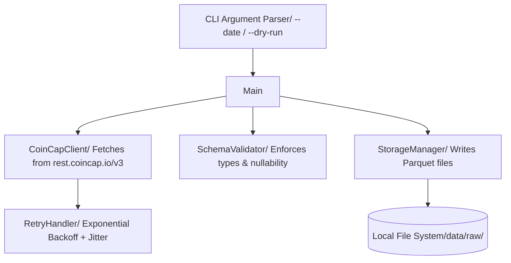
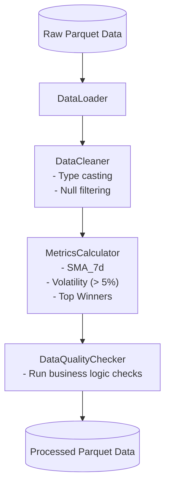
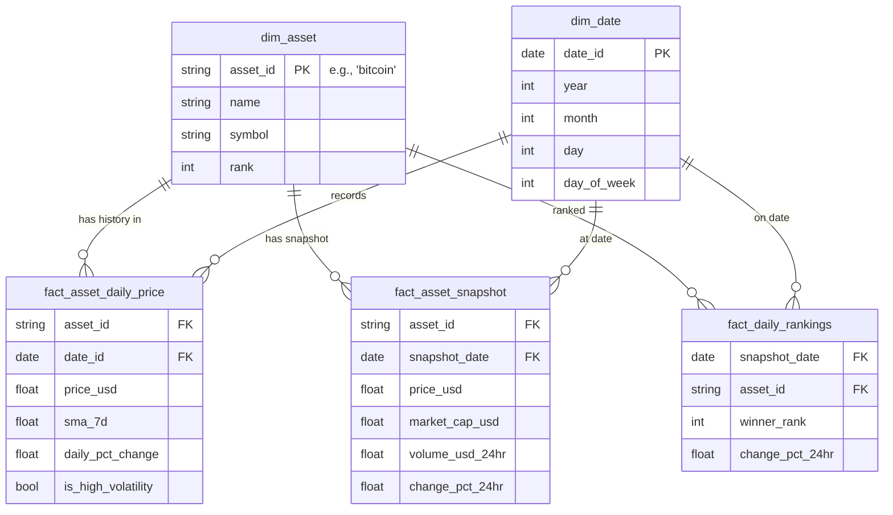
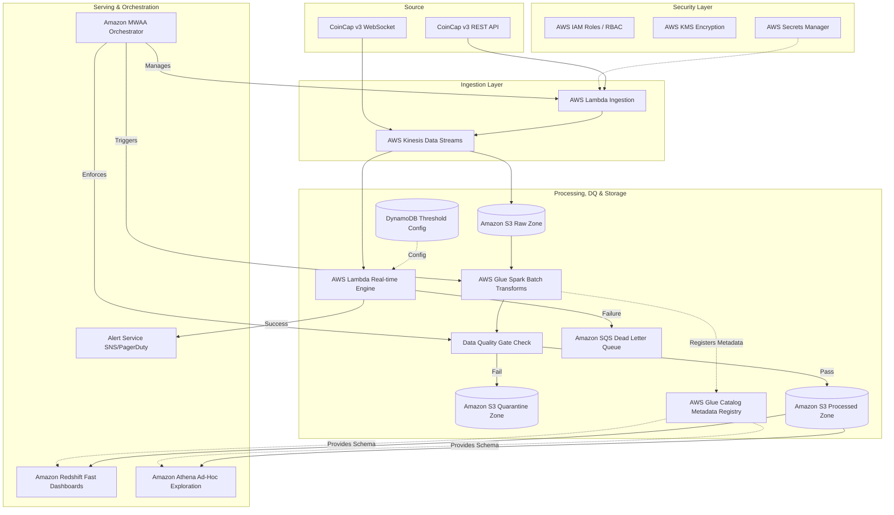

# Crypto Market Data Pipeline - Phase 1: Ingestion

## Purpose
This pipeline ingests cryptocurrency market data from the CoinCap API v3.
It fetches the top 50 assets by market cap and the last 20 days of historical data for configured coins (Bitcoin, Ethereum, Tether). The data is validated against expected schemas and stored idempotently as partitioned Parquet files for downstream processing.

## Architecture Diagram



## Setup Instructions

1. Install dependencies:
   ```bash
   pip install -r requirements.txt
   ```
2. Configure environment:
   Copy `.env.example` to `.env` and fill in the values.
   **Crucial:** `COINCAP_API_KEY` is **mandatory** for v3. You can get a free key (4000 tokens/month) at [coincap.io/api-key](https://coincap.io/api-key).

## API Version Note
This pipeline uses **CoinCap API v3** (`rest.coincap.io/v3`). The older v2 (`api.coincap.io/v2`) was deprecated on April 5, 2025. In v3, the API key is passed as an `?apiKey=` query parameter on every request, not as an Authorization header.

## How to Run

1. **Standard run (defaults to today's date):**
   ```bash
   python ingest.py
   ```
2. **Run for a specific date:**
   ```bash
   python ingest.py --date 2024-01-15
   ```
3. **Dry-run (fetch, validate, but skip writing to disk):**
   ```bash
   python ingest.py --dry-run
   ```

## Output Structure
The pipeline organizes raw data into partitioned Parquet files:
```text
data/raw/
├── assets/
│   └── date=YYYY-MM-DD/
│       └── assets.parquet
└── history/
    ├── coin=bitcoin/
    │   └── date=YYYY-MM-DD/
    │       └── history.parquet
    ├── coin=ethereum/
    │   └── ...
    └── coin=tether/
        └── ...
```

## Idempotency Guarantee
The storage layer is idempotent based on file existence. If a file already exists at the target path for a specific partition (e.g., `date=2024-01-15`), the `StorageManager` will skip the file overwrite and log a warning. To force a re-ingestion, manually delete the destination file before running the script.

## Rate Limit Handling
CoinCap applies rate limits (HTTP 429). The `RetryHandler` elegantly manages these using exponential backoff with jitter to prevent a thundering herd. It also retries on transient connection errors and timeouts (up to `MAX_RETRIES`), pausing between attempts.

## Schema Enforcement
The `SchemaValidator` guarantees that data fits the expected format before persisting it to disk. 
- Numeric fields returned as strings by the API are explicitly cast to numeric types (`float` or nullable `Int64`).
- If a required column is entirely missing, or if a particular value cannot be cast to the specified type, a `SchemaValidationError` is raised, forcing the pipeline to fail early and loudly.

## Sample Output Files
Representative outputs are located in the `samples/` directory:
- `samples/sample_assets.parquet`
- `samples/sample_history_bitcoin.parquet`

# Crypto Market Data Pipeline - Phase 2: Transformation

## Purpose
This phase takes the raw, partitioned Parquet data generated in Phase 1 and applies business transformations. It cleans the data, calculates Simple Moving Averages (SMA), identifies high-volatility days, ranks the top 5 assets by 24-hour performance, and runs automated programmatic data quality checks before persisting the processed data.

## Architecture & Flow



## How to Run

1. Ensure you have run the Phase 1 Ingestion first to populate `data/raw/`.
2. Run standard transformation (processes latest available assets, all history):
   ```bash
   python transform.py
   ```
3. Run transformation for a specific ingestion date:
   ```bash
   python transform.py --date 2024-01-15
   ```

## Output Structure
The processed data is persisted into `data/processed/` using the following structure:
```text
data/processed/
├── sma/
│   └── coin={coin_id}/
│       └── sma.parquet
├── volatility/
│   └── coin={coin_id}/
│       └── volatility.parquet
└── rankings/
    └── top_winners.parquet
```

## Programmatic Data Quality Checks
`DataQualityChecker` runs several checks inline during transformation:
- **Volume check**: Ensures `volumeUsd24Hr` is never negative.
- **Date gap check**: Asserts there's exactly 1 record per calendar day between min and max dates.
- **SMA completeness**: Validates that SMA is calculated for every row.

Failed checks are logged as `WARNING` but do not currently stop execution.

## Entity-Relationship Diagram



# Crypto Market Data Pipeline -Phase 3: Architecture


## 1. Tech Stack & Cost Justification

**Context & Scale:** As per our requirement, the system must handle 5,000 coins updating at a 1-minute frequency. This translates to ~5,000 records/minute (~83 records/second).

**Ingestion Layer:**
- **AWS Kinesis Data Streams:** Chosen over Kafka for cost-efficient scaling. **Scale/Cost Math:** At 5,000 msgs/min (83 msgs/sec), Kinesis costs roughly ~$45/month to operate. A managed Kafka cluster (Amazon MSK) requires an always-on baseline compute cluster costing upwards of ~$300/month. For this MVP scale, Kinesis is the mathematically correct choice.
- **CoinCap v3 API:** The real-time data source.
- **AWS Lambda (Ingestion):** Polling fallback triggered by EventBridge. **Execution Transition:** The `ingest.py` logic built in Phase 1 directly ports here. The `CoinCapClient` utilizing the `RetryHandler` (Exponential Backoff for 429 rate limits) and `SchemaValidator` will run as the Lambda function body, publishing valid Parquet/JSON records natively to Kinesis instead of the local disk.

**Storage Layer:**
- **Amazon S3:** Central Data Lake partitioned by execution date (`YYYY-MM-DD`) into zones (`S3Raw`, `S3Proc`, `S3Quarantine`).
- **AWS Glue Catalog:** Acts strictly as the metadata registry. It is *not* a storage destination; it registers table schemas natively enabling downstream query engines to read S3 objects.
- **Amazon Athena:** Used for ad-hoc, low-cost data science exploration and debugging queries directly on the S3 Data Lake without provisioning infrastructure.
- **Amazon Redshift Serverless:** The Serving Layer. Unlike Athena, Redshift provides sub-second query caching required for outward-facing production dashboards and aggregated BI alerts.

**Processing & Data Quality Layer:**
- **AWS Glue (Spark):** Handles heavy batch transformations. **Execution Transition:** The Pandas logic from `transform.py` Phase 2 (calculating the 7-day SMA, identifying High Volatility days > 5%, and ranking Top 5 Winners) will be rewritten in PySpark. This ensures the SMA calculation can horizontally scale across all 5,000 assets simultaneously.
- **Data Quality (DQ) Checkpoint:** Deployed immediately after GlueBatch computation. **Execution Transition:** The `DataQualityChecker` from Phase 2 (asserting `volumeUsd24Hr` is non-negative and preventing date gaps) becomes a strict validation gate here. Valid data lands in `S3Proc`. Invalid records are strictly routed to `S3Quarantine` to prevent corrupted data from poisoning Redshift.
- **AWS Lambda (Real-time):** Performs lightweight stream transformations. 
- **Amazon SQS Dead Letter Queue (DLQ):** Failed real-time Lambda processing events are routed to a DLQ to guarantee zero dropped events during a market spike.
- **Threshold Store:** Alert thresholds are decoupled from Lambda code and stored in **Amazon DynamoDB**, enabling dynamic updates for multi-client alerting.

## 2. Security & Compliance (Fintech Standard)
- **IAM Role Separation:** Strict Least Privilege access (RBAC). The ingestion Lambda role cannot write to `S3Proc`, and the Glue role cannot read `SecretsManager`.
- **Data at Rest (KMS):** All S3 buckets (`S3Raw`, `S3Proc`, `S3Quarantine`) are encrypted automatically at rest using **AWS KMS** (SSE-KMS).
- **Network Isolation:** Kinesis streams and Lambdas reside within a private VPC. AWS PrivateLink is utilized to ensure traffic never traverses the public internet.
- **Secrets Management:** The API Key is securely stored, rotated, and audited in **AWS Secrets Manager**, averting hardcoded credentials.

## 3. Orchestration
- **Apache Airflow (Amazon MWAA):** The brain of the pipeline. It doesn't just trigger jobs—it manages S3 landing sensors, triggers the Data Quality (DQ) validation gates inline, and orchestrates historical backfill DAGs across wide date ranges.
- **DAG Flow:** `ingest_dag` -> `S3KeySensor` -> `transform_dag` (enforces DQ).

## 4. Partitioning Strategy
**Exact S3 Key Structure:**
```text
s3://fintech-data-lake/
├── raw/
│   └── history/coin=bitcoin/year=2024/month=01/day=15/...
├── quarantine/
│   └── history/coin=bitcoin/year=2024/month=01/day=15/...
└── processed/
    └── fact_asset_daily_price/coin=bitcoin/year=2024/month=01/day=15/...
```
**Justification:** Partitioning by `coin` first immediately prunes the vast majority of irrelevant data during downstream queries.

## 5. Backfilling Strategy
1. **Isolation:** Deploy fixed transformation logic as a separate AWS Glue Job version.
2. **Backfill DAG:** Create `backfill_sma_dag` configured with `catchup=True` in MWAA.
3. **Shadow Table Write:** Write the output to a shadow path (`processed/fact_v2/`).
4. **Validation Gate:** Assert random sample diffs < 0.01% between `v1` (the old buggy production table) and `v2` (the newly backfilled shadow table).
5. **Atomic Swap:** Leverage Apache Iceberg's metadata pointers to perform an atomic table branch swap. This instantly redirects all downstream queries from `v1` to `v2`, achieving the completely backfilled transition with zero downtime.

## 6. Architecture Diagram



## 7. Justification of Trade-offs (Cost vs. Latency)

### Ingestion: Kinesis vs. Kafka
- **Requirement:** 1-minute updates for 5k coins (~83 msgs/sec).
- **Latency Trade-off:** Kinesis (~200ms latency) vs. Kafka (<10ms latency).
- **Cost Justification:** 200ms is perfectly acceptable for a 1-minute SLA. At 5,000 msgs/min, Kinesis costs ~$45/month. A managed Kafka cluster demands ~$300/month. Kinesis saves thousands in infra costs for zero business impact initially.

### Processing: AWS Glue vs. Spark Streaming / Flink
- **Requirement:** Daily analytical metrics (7-Day SMA, Volatility).
- **Latency Trade-off:** Glue Batch (5-min delay) vs. Flink (Instant).
- **Cost Justification:** An always-on Streaming cluster is prohibitively expensive for a startup MVP. Running scheduled 5-minute Glue micro-batches slashes compute costs by ~90%, while a 5-minute lag on a *7-Day average* calculation is imperceptible to MVP users.

---

## 8. CI/CD Proposal
- **Pipeline Runner:** Use **GitHub Actions** to govern the deployment lifecycle.
- **Stages:** 
  1. `lint`: Execute `ruff` to enforce code quality.
  2. `test`: Execute `pytest` suites bridging core logic and schema validators.
  3. `build/push`: Package dependencies into Docker containers and push to AWS ECR.
  4. `deploy`: Deploy using Infrastructure as Code (Terraform/CDK).
- **Environment Isolation:** Map branches to separate AWS environments (`dev` -> `staging` -> `main`).
- **Data Contract Testing:** As part of the `test` stage, execute the `SchemaValidator` against the live CoinCap API. This detects upstream schema breakages before they are ever deployed to production.
