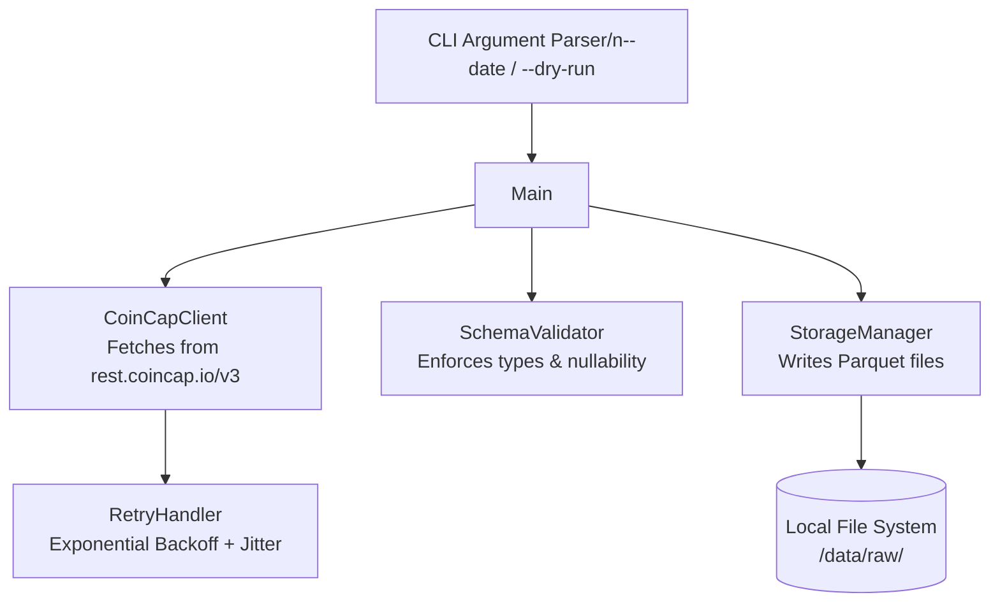

# Crypto Market Data Pipeline - Phase 1: Ingestion

## Purpose
This pipeline ingests cryptocurrency market data from the CoinCap API v3.
It fetches the top 50 assets by market cap and the last 20 days of historical data for configured coins (Bitcoin, Ethereum, Tether). The data is validated against expected schemas and stored idempotently as partitioned Parquet files for downstream processing.

## Architecture Diagram



## Setup Instructions

1. Install dependencies:
   ```bash
   pip install -r requirements.txt
   ```
2. Configure environment:
   Copy `.env.example` to `.env` and fill in the values.
   **Crucial:** `COINCAP_API_KEY` is **mandatory** for v3. You can get a free key (4000 tokens/month) at [coincap.io/api-key](https://coincap.io/api-key).

## API Version Note
This pipeline uses **CoinCap API v3** (`rest.coincap.io/v3`). The older v2 (`api.coincap.io/v2`) was deprecated on April 5, 2025. In v3, the API key is passed as an `?apiKey=` query parameter on every request, not as an Authorization header.

## How to Run

1. **Standard run (defaults to today's date):**
   ```bash
   python ingest.py
   ```
2. **Run for a specific date:**
   ```bash
   python ingest.py --date 2024-01-15
   ```
3. **Dry-run (fetch, validate, but skip writing to disk):**
   ```bash
   python ingest.py --dry-run
   ```

## Output Structure
The pipeline organizes raw data into partitioned Parquet files:
```text
data/raw/
├── assets/
│   └── date=YYYY-MM-DD/
│       └── assets.parquet
└── history/
    ├── coin=bitcoin/
    │   └── date=YYYY-MM-DD/
    │       └── history.parquet
    ├── coin=ethereum/
    │   └── ...
    └── coin=tether/
        └── ...
```

## Idempotency Guarantee
The storage layer is idempotent based on file existence. If a file already exists at the target path for a specific partition (e.g., `date=2024-01-15`), the `StorageManager` will skip the file overwrite and log a warning. To force a re-ingestion, manually delete the destination file before running the script.

## Rate Limit Handling
CoinCap applies rate limits (HTTP 429). The `RetryHandler` elegantly manages these using exponential backoff with jitter to prevent a thundering herd. It also retries on transient connection errors and timeouts (up to `MAX_RETRIES`), pausing between attempts.

## Schema Enforcement
The `SchemaValidator` guarantees that data fits the expected format before persisting it to disk. 
- Numeric fields returned as strings by the API are explicitly cast to numeric types (`float` or nullable `Int64`).
- If a required column is entirely missing, or if a particular value cannot be cast to the specified type, a `SchemaValidationError` is raised, forcing the pipeline to fail early and loudly.

## Sample Output Files
Representative outputs are located in the `samples/` directory:
- `samples/sample_assets.parquet`
- `samples/sample_history_bitcoin.parquet`
