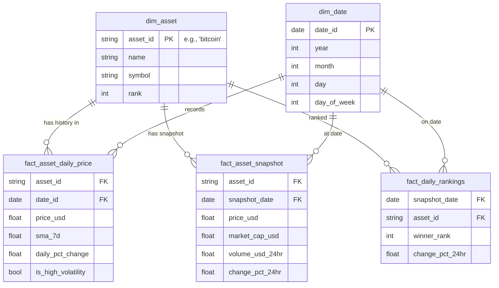

# Crypto Market Data Pipeline - Phase 2: Transformation

## Purpose
This phase takes the raw, partitioned Parquet data generated in Phase 1 and applies business transformations. It cleans the data, calculates Simple Moving Averages (SMA), identifies high-volatility days, ranks the top 5 assets by 24-hour performance, and runs automated programmatic data quality checks before persisting the processed data.

## Architecture & Flow

```mermaid
flowchart TD
    Raw[(Raw Parquet Data)] --> Loader[DataLoader]
    Loader --> Cleaner[DataCleaner\n- Type casting\n- Null filtering]
     Cleaner --> Metrics[MetricsCalculator\n- SMA_7d\n- Volatility (>\5%)\n- Top Winners]
     Metrics --> DQ[DataQualityChecker\n- Run business logic checks]
     DQ --> Processed[(Processed Parquet Data)]
```

## How to Run

1. Ensure you have run the Phase 1 Ingestion first to populate `data/raw/`.
2. Run standard transformation (processes latest available assets, all history):
   ```bash
   python transform.py
   ```
3. Run transformation for a specific ingestion date:
   ```bash
   python transform.py --date 2024-01-15
   ```

## Output Structure
The processed data is persisted into `data/processed/` using the following structure:
```text
data/processed/
├── sma/
│   └── coin={coin_id}/
│       └── sma.parquet
├── volatility/
│   └── coin={coin_id}/
│       └── volatility.parquet
└── rankings/
    └── top_winners.parquet
```

## Programmatic Data Quality Checks
`DataQualityChecker` runs several checks inline during transformation:
- **Volume check**: Ensures `volumeUsd24Hr` is never negative.
- **Date gap check**: Asserts there's exactly 1 record per calendar day between min and max dates.
- **SMA completeness**: Validates that SMA is calculated for every row.

Failed checks are logged as `WARNING` but do not currently stop execution.

## Entity-Relationship Diagram


